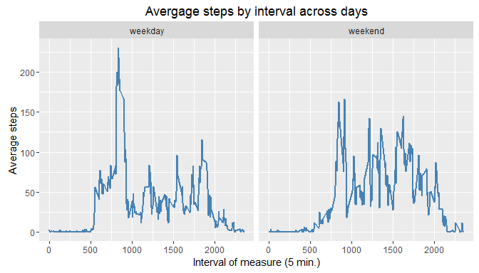

# Reproducible Research: Peer Assessment 1


## Loading and preprocessing the data
The following code unzips the activity.zip file into the working directory and load
the content (i.e. activity.csv file) into a dataframe in R. A new dataframe is created
with the date variable coursed to Date class.

```r
library(dplyr)
library(ggplot2)
options(scipen = 999)
unzip("activity.zip")
raw_activity<-read.csv("activity.csv", header=TRUE)
p_activity<-raw_activity
p_activity$date<-as.Date(p_activity$date)
```


## What is mean total number of steps taken per day?
Code to generate a summarised dataframe with the total number of steps per day, an
histogram and the statistic mean and median of the total number of steps.

```r
Total_activity<-group_by(p_activity, date)
Total_activity<-summarise(Total_activity, Total_steps=sum(steps))

plot1<-ggplot(Total_activity, aes(x=Total_steps))+
    geom_histogram(binwidth = 3000, color="black", fill="green3")+
    xlab("Total number of steps")+
    ylab("Count")+
    ggtitle("Histogram total number of steps")

mean_total_steps<-mean(Total_activity$Total_steps, na.rm=T)
median_total_steps<-median(Total_activity$Total_steps, na.rm=T)
```
An histogram shows the frequency of the total step number using a bin of 3000 steps.

<!-- -->

Total number of steps: mean=10766.1886792; median=10765

## What is the average daily activity pattern?
The following code generates a time series plot of the average of steps taken across days

```r
average_activity<-group_by(p_activity, interval)
average_activity<-summarise(average_activity, mean_steps=mean(steps, na.rm = T))

plot2<-ggplot(average_activity, aes(x=interval, y=mean_steps))+
    geom_line(colour="steelblue", size=1)+ylab("Average steps")+
    xlab("Interval of measure (5 min.)")+
    ggtitle("Avergage steps by interval across days")

max_interval<-average_activity$interval[average_activity$mean_steps==
                                            max(average_activity$mean_steps)]
```
Time series plot:

<!-- -->

The interval were the average of steps across days is maximum is 835.

## Imputing missing values
The following code impute the missing values in the original dataset by the mean
of the respective interval across days. An histogram is generated using the new 
dataframe with the interpolated missing values.

```r
NA_values<-sum(is.na(p_activity$steps))

NoNA_activity<-p_activity[is.na(p_activity$steps)==T,c("interval", "date")]
NoNA_activity<-merge(NoNA_activity, average_activity, by="interval")
names(NoNA_activity)<-c("interval", "date", "steps")

NoNA_activity<-rbind(p_activity[is.na(p_activity$steps)==F,],NoNA_activity)

Total_NoNA_activity<-group_by(NoNA_activity, date)
Total_NoNA_activity<-summarise(Total_NoNA_activity, Total_steps=sum(steps))

plot3<-ggplot(Total_NoNA_activity, aes(x=Total_steps))+
    geom_histogram(binwidth = 3000, color="black", fill="green3")+
    xlab("Total number of steps")+
    ylab("Count")+
    ggtitle("Histogram total number of steps")

mean_total_NoNA<-mean(Total_NoNA_activity$Total_steps)
median_total_NoNA<-median(Total_NoNA_activity$Total_steps)
```

<!-- -->

The total of missing values in the original data set is 2304. Interpolating
the missing values by the mean of the respective interval across days doesn't change
the mean of the total number of steps (mean with NA=10766.1886792 vs. mean 
NA filled= 10766.1886792). However the median changes (median with NA=10765 vs. median NA filled=10766.1886792).

## Are there differences in activity patterns between weekdays and weekends?
The following code generated a new variable call "weekday" that store whether the 
measured day is a week day or a weekend day. A time series plot with two panels 
(week days and weekends) is generated representig the average of steps by intervals
across days.


```r
NoNA_activity$dayofweek<-weekdays(NoNA_activity$date)
NoNA_activity$weekday<-with(NoNA_activity, ifelse(dayofweek%in%c("sábado","domingo"), 
                                                  "weekend", "weekday"))
ggplot(NoNA_activity, aes(x=interval, y=steps))+
    stat_summary(fun.y = "mean", geom="line", colour="steelblue", size=1)+
    ylab("Average steps")+
    xlab("Interval of measure (5 min.)")+
    ggtitle("Avergage steps by interval across days")+
    facet_grid(~weekday)
```

<!-- -->
